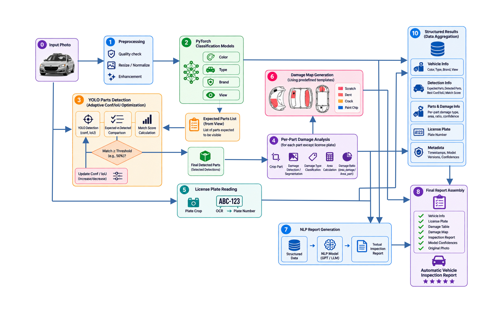

# AVIS — Automatic Vehicle Inspection System

AVIS is an end-to-end deep learning system for automatic vehicle inspection from a single image.

The system analyzes a vehicle photo, identifies vehicle characteristics, detects visible parts and damages, reads the license plate, generates a damage map, and produces a final inspection report.

The project combines computer vision, object detection, OCR, image processing, and NLP models into one complete inspection pipeline.

---

## Project Overview

AVIS performs the following tasks:

- Vehicle color classification
- Vehicle type classification
- Vehicle brand classification
- Vehicle view / orientation classification
- Expected visible parts estimation
- Vehicle parts detection
- Adaptive Confidence / IoU optimization
- Per-part damage detection and analysis
- License plate recognition
- Damage map generation
- Structured inspection data aggregation
- NLP-based inspection report generation
- Final HTML report assembly

---

## AVIS Pipeline

The diagram below shows the complete AVIS workflow, from the input image to the final inspection report.



The pipeline combines several independent machine learning models. Their predictions are aggregated into a common structured result and then used for damage visualization and automatic textual report generation.

---

## Pipeline Stages

### 1. Image Preprocessing

The input vehicle image is prepared for further processing.

Depending on the model, preprocessing may include:

- image loading;
- resizing;
- normalization;
- format conversion;
- model-specific transformations.

---

### 2. Vehicle Classification

Several PyTorch classification models analyze the complete vehicle image.

The system predicts:

- **Color**
- **Vehicle Type**
- **Brand**
- **View**

EfficientNet-B0 is used as the main architecture for vehicle classification tasks.

The orientation model predicts one of eight vehicle views:

```text
Front
Front Right
Right
Rear Right
Rear
Rear Left
Left
Front Left
```

The predicted view is also used to determine which vehicle parts should normally be visible in the image.

---

### 3. Expected Parts List

The vehicle view is converted into a list of expected visible parts.

For example, a front-right view can include:

```text
Hood
Front Bumper
Windshield
Right Headlight
Right Front Fender
Right Front Door
Right Side Mirror
Right Front Wheel
License Plate
```

This expected-parts list is used during vehicle parts detection.

---

### 4. Vehicle Parts Detection

Vehicle parts are detected using YOLO.

Instead of relying only on one fixed Confidence and IoU configuration, AVIS evaluates several parameter combinations.

The system compares detection results and selects the configuration that produces the best number of useful detected parts.

This approach makes the parts detection stage less dependent on occasional errors in vehicle-view prediction.

Detected parts may include:

```text
Hood
Front Bumper
Rear Bumper
Windshield
Rear Window
Headlights
Tail Lights
Front Doors
Rear Doors
Fenders
Wheels
Side Mirrors
License Plate
Grille
Trunk
Roof
```

---

### 5. Per-Part Damage Analysis

After vehicle parts are detected, each relevant part is cropped and analyzed independently.

The damage model detects damage types such as:

```text
Scratch
Dent
Smash
Glass Break
Broken Light
```

For each detected damage, AVIS can store:

- damage type;
- confidence;
- bounding box;
- damaged area;
- damage-area ratio;
- corresponding vehicle part.

Analyzing separate vehicle parts makes it possible to associate damages with specific components instead of only detecting damage somewhere on the full vehicle image.

---

### 6. License Plate Recognition

AVIS first checks whether the license plate was already detected by the vehicle-parts model.

If a license plate crop is available, it is passed directly to OCR.

If the plate is missing from the detected parts, a separate license plate detection model can be used as a fallback.

The cropped license plate image is then processed by OCR to extract the plate number.

---

### 7. Damage Map Generation

Detected damaged parts are converted into a visual damage map.

AVIS uses a predefined vehicle template divided into vehicle-part regions.

When a part is detected as damaged, the corresponding region is highlighted on the vehicle scheme.

The resulting damage map provides a compact visual representation of the inspection result and is included in the final report.

---

### 8. Structured Results

Outputs from all pipeline stages are collected into a common `inspection_result` structure.

A simplified example:

```python
inspection_result = {
    "original_image": image,
    "image_path": image_path,

    "vehicle": {
        "brand": ...,
        "type": ...,
        "color": ...,
        "view": ...,
    },

    "parts_detection": ...,

    "damage_analysis": ...,

    "license_plate": {
        "text": ...,
        "confidence": ...,
        "image": ...,
    },

    "damage_map": ...,

    "summary": ...,
}
```

Using one structured result makes it possible to pass information between different computer vision, OCR, NLP, and reporting stages.

---

### 9. NLP Report Generation

Structured inspection results are converted into a human-readable vehicle inspection description.

The project evaluates several Transformer architectures:

- GPT-2
- FLAN-T5-small
- FLAN-T5-base
- BART-base

The NLP model receives structured information such as:

```text
Vehicle Brand
Vehicle Type
Color
View
License Plate
Damaged Parts
Damage Types
```

and generates a textual inspection report.

---

### 10. Final Inspection Report

The final report combines:

- original vehicle image;
- vehicle classification results;
- model confidence values;
- license plate;
- detected vehicle parts;
- detected damages;
- damage information;
- damage map;
- generated textual inspection description.

The final output is saved as an HTML inspection report.

---

## Technologies

AVIS is implemented in Python and uses the following technologies.

### Deep Learning

- PyTorch
- Torchvision
- EfficientNet-B0
- DeepLabV3
- Ultralytics YOLO

### NLP

- Hugging Face Transformers
- GPT-2
- FLAN-T5
- BART

### OCR

- PaddleOCR
- EasyOCR

### Image Processing and Data Analysis

- OpenCV
- Pillow
- NumPy
- Pandas
- Matplotlib

---

## Project Structure

```text
AVIS_final_project/
│
├── main.py
├── pyproject.toml
├── README.md
│
├── src/
│   ├── pipeline.py
│   ├── run_func.py
│   ├── report.py
│   ├── nlp_report.py
│   ├── damage_map_generator.py
│   ├── dataset.py
│   ├── train_test.py
│   └── result_plots.py
│
├── media/
│   └── pipeline.png
│
├── run_check/
│   └── ex.jpg
│
├── damage_map/
│   └── ...
│
├── trained_pytorch_models/
│   └── ...
│
├── trained_models/
│   └── ...
│
├── runs/
│   └── ...
│
└── reports/
    └── ...
```

Some notebooks and training-related files are also included for model development, experiments, and result analysis.

---

## Installation

Clone the repository:

```bash
git clone https://github.com/IliaAndreevVia/AVIS_final_project.git
cd AVIS_final_project
```

Install dependencies using `uv`:

```bash
uv sync
```

A CUDA-compatible GPU is recommended for running the full pipeline.

---

## Running AVIS

A demonstration image is provided in:

```text
./run_check/ex.jpg
```

Because this path is used as the default input, AVIS can be launched simply with:

```bash
python main.py
```

The default input image is:

```text
./run_check/ex.jpg
```

The default report path is:

```text
./reports/report.html
```

---

## Running with Another Image

A custom vehicle image can be passed using `--image`:

```bash
python main.py --image ./path/to/vehicle.jpg
```

A custom report path can also be provided:

```bash
python main.py \
    --image ./path/to/vehicle.jpg \
    --report ./reports/custom_report.html
```

---

## Command Line Arguments

### `--image`

Path to the vehicle image.

Default:

```text
./run_check/ex.jpg
```

### `--report`

Path to save the HTML inspection report.

Default:

```text
./reports/report.html
```

Example:

```bash
python main.py \
    --image ./run_check/ex.jpg \
    --report ./reports/report.html
```

---

## Running the Pipeline from Python

The inspection pipeline can also be called directly from Python:

```python
from pathlib import Path

from src.pipeline import run_inspection

inspection_result = run_inspection(
    img_path=Path("./run_check/ex.jpg"),
    report_save_folder=Path("./reports"),
)
```

The returned dictionary contains the results produced by the complete AVIS pipeline.

---

## Example Console Output

```text
============================================================
AVIS — Automatic Vehicle Inspection System
============================================================

Image: run_check/ex.jpg

============================================================
Inspection completed
============================================================

Brand: Toyota (0.91)
Type: car (0.97)
Color: white (0.94)
View: Front Right (0.88)

License plate: 64-627-74

Damaged parts: 2
Damage detections: 3

Report saved to: reports/report.html
```

> The values above are provided only as an example. Actual predictions depend on the input image and trained model outputs.

---

## Project Goal

The main purpose of AVIS is to demonstrate how several different machine learning tasks can be combined into one end-to-end real-world system.

AVIS integrates:

```text
Image Classification
        +
Object Detection
        +
Damage Analysis
        +
OCR
        +
Damage Visualization
        +
NLP
        ↓
Automatic Vehicle Inspection
```

Instead of solving only one isolated prediction task, the project demonstrates how outputs from several models can interact and form one complete inspection workflow.

---

## Limitations

AVIS is currently a prototype developed as a final Data Science project.

Current limitations include:

- the inspection is based only on information visible in the provided image;
- hidden or mechanical vehicle damage cannot be detected;
- prediction accuracy depends on image quality;
- unusual viewing angles can affect classification and detection;
- small or partially occluded vehicle parts may not be detected;
- damage detection quality depends on the training dataset;
- OCR accuracy depends on plate visibility and image resolution;
- one image cannot provide complete information about all sides of a vehicle;
- NLP report quality depends on the training data and selected language model.

---

## Future Improvements

Possible future improvements include:

- multi-image vehicle inspection;
- automatic combination of several vehicle views;
- complete 360-degree vehicle inspection;
- damage severity estimation;
- improved damage segmentation;
- more accurate vehicle model recognition;
- improved license plate recognition;
- comparison of vehicle condition before and after rental;
- automatic detection of newly appeared damage;
- web interface;
- REST API;
- cloud deployment;
- inspection history database;
- integration with vehicle rental or insurance systems.

---

## Author

**Ilia Andreev**

Final Data Science project.

GitHub:  
https://github.com/IliaAndreevVia/AVIS_final_project